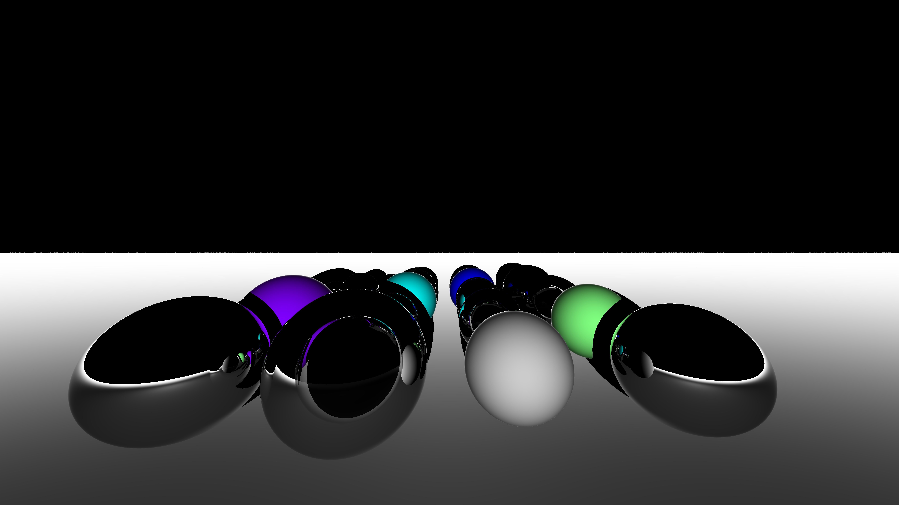

# Ray Tracing Techniques

This repository contains several fundamental ray tracing techniques implemented in C++. The techniques, ranging from basic ray tracing to advanced methods like global illumination and volume rendering.

## Implemented Techniques

- **Ray Tracing** with Blinn-Phong shading for rendering 3D meshes.
- **Whitted Ray Tracing** with support for reflection and refraction.
- **Path Tracing** (Global Illumination) using BRDF sampling and Next Event Estimation.
- **Volume Rendering** via both Forward and Backward Ray Marching.

## Results

### Ray Tracing with Blinn-Phong Shading

  

<i>Sphere on the ground</i>

  
  

<i>Left: Barrel | Right: Motocompo</i>

### Whitted Ray Tracing 

### Path Tracing

### Volume Rendering: Forward vs Backward Ray Marching  

  
  

<i>Left: Forward Ray Marching | Right: Backward Ray Marching</i>
